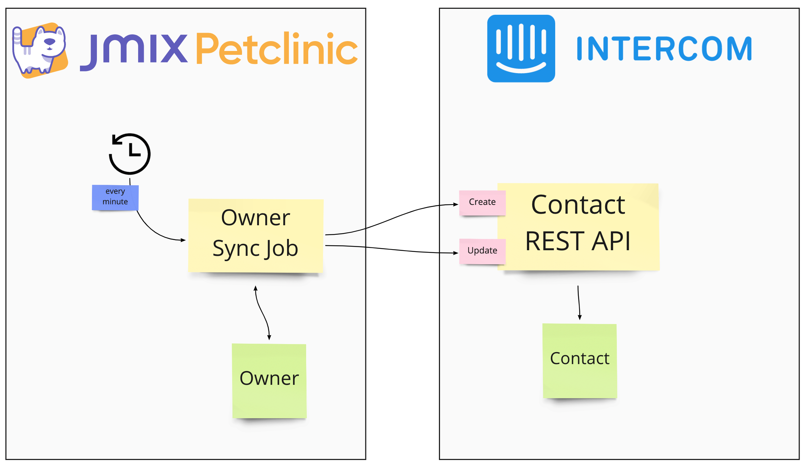

<p align="center">
  
</p>


# Jmix Petclinic - Intercom


## Jmix Petclinic Intercom Widget Integration

### 1. Custom WidgetSet

Replace 

```groovy

dependencies {
    implementation 'io.jmix.ui:jmix-ui-widgets-compiled'
}
```

with:
```groovy
dependencies {
    implementation 'io.jmix.ui:jmix-ui-widgets'
    widgets 'io.jmix.ui:jmix-ui-widgets'
}
```

### 2. Create Intercom Integration

(based on https://github.com/wbadam/Intercom)

* [IntercomIntegration Connector](src/main/java/io/jmix/petclinic/widgets/IntercomIntegration.java)
* [IntercomState](src/main/java/io/jmix/petclinic/widgets/client/IntercomState.java)
* [intercom.js](src/main/resources/io/jmix/petclinic/widgets/intercom.js)


## Owner Sync

Owners are synced from the Application via the Intercom REST API. The sync is done on a schedule (every minute).

The logic uses the Contact Search API to find contacts in Intercom based on the external ID or the Email. If any 
of those match, the contact will be updated. Otherwise, a new Contact will be created.




## Show upcoming Visits in the Intercom inbox

Another example of an integration is to show specific data inside the inbox of Intercom. This way, the doctors can see 
relevant information directly next to the conversation and therefore improve the quality / speed of the conversation.

The example use-case is the following: 

When a Nurse user has a question about a particular upcoming visit, they can reach out via chat to the doctors.

Additionally, to the actual conversation in Intercom, there is the upcoming visits shown as contextual information for
the Doctors:


This is done by using creating a custom CanvasKit app, that requests a custom UI from the Petclinic application. 
The petclinic app sends back information about the to-be-rendered UI in Intercom through a specific JSON structure that
represents this UI.

## See recent events in Intercom inbox

Next to the upcoming visits, it is also possible to see recent events that happened inside the Petclinic application for this particular user.
This way the doctors can see which visit the nurse recently started / finished the treatment.


This is done by using the Intercom REST API for notifying about events.


## Cancel Visits from within the Intercom Inbox

Another example on how to integrate the two systems is by creating a form inside the Intercom inbox which allows Doctors
to cancel visits. This is not possible for the nurse role, therefore it is needed to ask about a cancellation.


### 1. Cancel Visit Form in Inbox


### 2. Submitting Visit Cancellation


### 3. Cancelled Visit in the Petclinic application


This is done by another custom CanvasKit application. The application form is rendered by the Petclinic application.
The form submit is also received by the Petclinic application. It will then automatically update the Visit status and create
an instance of the `VisitCancellation` entity.
