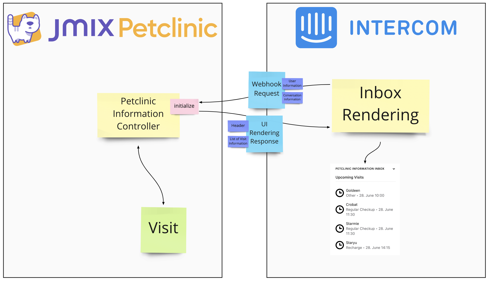

<p align="center">
  
</p>


# Jmix Petclinic - Intercom

This example shows how to integrate Jmix with Intercom in various ways. 

The final application can be found at: https://jmix-petclinic-intercom.herokuapp.com/ 

Note: initial load can take long (up to 30 seconds), since Heroku starts the application on demand.

## Table of Content

This example covers the following use-cases for the integration:

1. [Installation](#1-installation)
    * [Jmix Petclinic Intercom Widget Integration](#jmix-petclinic-intercom-widget-integration)
    * [Setup API integration via Intercom Developer Hub](#setup-api-integration-via-intercom-developer-hub)
2. [Intercom Inbox Integration](#2-intercom-inbox-integration)
    * [Contact Information - Owner Sync](#contact-information---owner-sync)
    * [Show upcoming Visits in the Intercom inbox](#show-upcoming-visits-in-the-intercom-inbox)
    * [See recent events in Intercom inbox](#see-recent-events-in-intercom-inbox)
    * [Cancel Visits from within the Intercom Inbox](#cancel-visits-from-within-the-intercom-inbox)
3. [Messenger Integration](#3-messenger-integration)
    * [Proactively offer support when Treatment started](#proactively-offer-support-when-treatment-started)
    * [Visit Booking for Owners through the Messenger](#visit-booking-for-owners-through-the-messenger)


## 1. Installation

In the first section, we will install the Intercom Messenger so that the users can interact with the Intercom chat system.
There is also a need to exchange some API credentials / creating some apps in Intercom, to let the applications talk to each other.

### Jmix Petclinic Intercom Widget Integration

#### Custom WidgetSet

Replace 

```groovy

dependencies {
    implementation 'io.jmix.ui:jmix-ui-widgets-compiled'
}
```

with:
```groovy
dependencies {
    implementation 'io.jmix.ui:jmix-ui-widgets'
    widgets 'io.jmix.ui:jmix-ui-widgets'
}
```

#### Create Intercom Integration

Once the Vaadin setup is done, we can create our custom Widget for the Intercom Messenger. This 
is based on https://github.com/wbadam/Intercom, where this has been done for plain Vaadin.

See more information on the implementation:

* [IntercomIntegration Connector](src/main/java/io/jmix/petclinic/widgets/IntercomIntegration.java)
* [IntercomState](src/main/java/io/jmix/petclinic/widgets/client/IntercomState.java)
* [intercom.js](src/main/resources/io/jmix/petclinic/widgets/intercom.js)


### Setup API integration via Intercom Developer Hub

For the following examples, we need multiple "Apps" in the [Intercom Developer Hub](https://developers.intercom.com/).


#### REST API Access

The App `Petclinic Contact Sync` is used for using the public REST API in order to synchronise Owners as Contacts in Intercom.
Additionally, it is used for sending events to Intercom.

The access token can be fetched from the `Configure > Authentication` menu of the App.


In the Petclinic demo application, the access token has to be put in the `application.properties` file under the key `intercom.sync.accessToken`. 
Environment variables should be used instead of putting the value directly into the source code.

#### CanvasKit Apps

For the UI Integration into the Intercom inbox, we need to create the CanvasKit configuration for the webhooks.

Intercom calls the Petclinic application to retrieve information about the UI that should be rendered.


## 2. Intercom Inbox Integration

The first part of the Integration is done within the Intercom Inbox. It helps the Doctors / Call center agents
to directly from within Intercom see Petclinic data and trigger common actions. This way
it prevents constantly switching tools in the day-to-day work of the Doctors when doing support requests.

### Contact Information - Owner Sync

Owners are synced from the Application via the Intercom REST API. The sync is done on a schedule (every minute).

The logic uses the Contact Search API to find contacts in Intercom based on the external ID or the Email. If any 
of those match, the contact will be updated. Otherwise, a new Contact will be created.


### Show upcoming Visits in the Intercom inbox

Another example of an integration is to show specific data inside the inbox of Intercom. This way, the doctors can see 
relevant information directly next to the conversation and therefore improve the quality / speed of the conversation.

The example use-case is the following: 

When a Nurse user has a question about a particular upcoming visit, they can reach out via chat to the doctors.

Additionally, to the actual conversation in Intercom, there is the upcoming visits shown as contextual information for
the Doctors:


This is done by using creating a custom CanvasKit app, that requests a custom UI from the Petclinic application. 
The petclinic app sends back information about the to-be-rendered UI in Intercom through a specific JSON structure that
represents this UI.



#### Implementation

The implementation of this Webhook interaction is done via regular Spring MVC controllers. In particular in this example the [PetclinicInformationController](src/main/java/io/jmix/petclinic/intercom/canvaskit/petclinic_information/PetclinicInformationController.java)
is handling the Webhook requests for rendering the List of upcoming visits. It performs the following steps:

1. looks up the User entity (Nurse) based on the Contact information of the Conversation in the Webhook request
2. Loads the upcoming visits of the Nurse
3. creates object tree representing the UI layout definition in Intercom

For the first step to be successful, it requires the external ID to be present in the Contact in Intercom. This is true, due to the fact that when the Messenger initializes in the [MainScreen](https://github.com/mariodavid/jmix-petclinic-intercom/blob/963f64a24389d5beb3f775314418a77529f74594/src/main/java/io/jmix/petclinic/screen/main/MainScreen.java#L67),
the UUID of the current user is passed in.

For the last step of rendering the UI, in the Jmix Petclinic there are POJOs for the JSON representation of all the UI components, that can be rendered (like button, list, etc.). Intercom does not provide Java classes for those UI components.

This is an example of the JSON response that defines how the UI should be rendered in the Intercom inbox: 
```json
{
    "canvas": {
        "content": {
            "components": [
                {
                    "id": "text",
                    "style": "header",
                    "text": "Upcoming Visits",
                    "type": "text"
                },
                {
                    "type": "divider"
                },
                {
                    "items": [
                        {
                            "id": "ea31793b-866a-03a5-5764-69e5cadc14b7",
                            "title": "Goldeen",
                            "subtitle": "Other",
                            "tertiary_text": "28. June 10:00",
                            "image": "https://cdn1.iconfinder.com/data/icons/essentials-pack/96/clock_time_alarm_watch_hour-128.png",
                            "image_width": 32,
                            "image_height": 32,
                            "disabled": false,
                            "action": {
                                "url": "https://jmix-petclinic-intercom.herokuapp.com/#main/visits/edit?id=7a65wkq1ka0ejnes39wq5dr55q",
                                "type": "url"
                            },
                            "type": "item"
                        },
                        {
                            "id": "a6e254a9-ac3d-1441-455c-44cd8cf99d81",
                            "title": "Crobat",
                            "subtitle": "Regular Checkup",
                            "tertiary_text": "28. June 11:30",
                            "image": "https://cdn1.iconfinder.com/data/icons/essentials-pack/96/clock_time_alarm_watch_hour-128.png",
                            "image_width": 32,
                            "image_height": 32,
                            "disabled": false,
                            "action": {
                                "url": "https://jmix-petclinic-intercom.herokuapp.com/#main/visits/edit?id=56w9aakb1x2h0maq24sp6fk7c1",
                                "type": "url"
                            },
                            "type": "item"
                        }
                    ],
                    "type": "list"
                }
            ]
        }
    }
}
```

See more information on the implementation:
* [PetclinicInformationController](src/main/java/io/jmix/petclinic/intercom/canvaskit/petclinic_information/PetclinicInformationController.java)
* [package petclinic_information](src/main/java/io/jmix/petclinic/intercom/canvaskit/petclinic_information)

### See recent events in Intercom inbox

Next to the upcoming visits, it is also possible to see recent events that happened inside the Petclinic application for this particular user.
This way the doctors can see which visit the nurse recently started / finished the treatment.


This is done by using the Intercom REST API for notifying about events.

#### Intercom notifications

The Triggering of the Notifications is implemented in this case within the UI controller of the `MyVisits` screen:

```java
public class MyVisits extends MasterDetailScreen<Visit> {
    
    // ...
    
    @Autowired
    protected IntercomNotifications intercomNotifications;

    @Subscribe("table.start")
    protected void onStart(Action.ActionPerformedEvent event) {
        final Visit visit = table.getSingleSelected();

        if (visit.hasStarted()) {
            petTreatmentWarningMessage("treatmentAlreadyStarted", visit.getPetName());
        } else {
            updateTreatmentTo(visit, VisitTreatmentStatus.IN_PROGRESS);
            petTreatmentSuccessMessage("treatmentStarted", visit.getPetName());
            intercomNotifications.notify(
                    TreatmentStartedEvent.builder()
                            .visit(visit)
                            .build()
            );
        }
    }

    @Subscribe("table.finish")
    protected void onTableFinish(Action.ActionPerformedEvent event) {
        final Visit visit = table.getSingleSelected();

        if (visit.hasFinished()) {
            petTreatmentWarningMessage("treatmentAlreadyFinished", visit.getPetName());
        } else {
            updateTreatmentTo(visit, VisitTreatmentStatus.DONE);
            petTreatmentSuccessMessage("treatmentFinished", visit.getPetName());
            intercomNotifications.notify(
                    TreatmentFinishedEvent.builder()
                            .visit(visit)
                            .build()
            );

        }
    }
}
```

The bean `IntercomNotifications` is responsible for sending out the events to Intercom via the [Data Events API](https://developers.intercom.com/intercom-api-reference/reference/submitting-events)

```java

import io.intercom.api.Event;
import io.intercom.api.Intercom;

// ...

@RequiredArgsConstructor
@Component("petclinic_IntercomNotifications")
public class IntercomNotifications {
    private final IntercomSyncConfig intercomSyncConfig;
    private final CurrentAuthentication currentAuthentication;
    private final Messages messages;
    private final DatatypeFormatter datatypeFormatter;

    public <T extends IntercomEvent> void notify(T event) {

        Intercom.setToken(intercomSyncConfig.getAccessToken());

        Event intercomEvent = new Event()
                .setEventName(event.getEventName())
                .setUserID(currentUserId())
                .setCreatedAt(event.getCreatedAt())
                .setMetadata(event.getMetadata(messages, datatypeFormatter));

        Event.create(intercomEvent);
    }

    private String currentUserId() {
        return ((User) currentAuthentication.getUser()).getId().toString();
    }
}
```

The instruction `Event.create()` is responsible for sending out the event to intercom via the [Java SDK](https://github.com/intercom/intercom-java).


### Cancel Visits from within the Intercom Inbox

Another example on how to integrate the two systems is by creating a form inside the Intercom inbox which allows Doctors
to cancel visits. This is not possible for the nurse role, therefore it is needed to ask about a cancellation.


#### Cancel Visit Form in Inbox


#### Submitting Visit Cancellation


#### Cancelled Visit in the Petclinic application


This is done by another custom CanvasKit application. The application form is rendered by the Petclinic application.
The form submit is also received by the Petclinic application. It will then automatically update the Visit status and create
an instance of the `VisitCancellation` entity.


See more information on the implementation:
* [CancelVisitController](src/main/java/io/jmix/petclinic/intercom/canvaskit/cancel_visit/CancelVisitController.java)
* [package cancel_visit](src/main/java/io/jmix/petclinic/intercom/canvaskit/cancel_visit)

## 3. Messenger Integration

Besides, improving the experience for the Doctors / Call center agents, it is also possible
to integrate the two systems in a way so that the users of the Messenger benefit. Indirectly it also helps
the Doctors, as bots take some heavy lifting from their shoulders and reduce the workload of support requests.


### Proactively offer support when Treatment started

It is also possible to trigger outbound bots through using incoming events as a trigger. Outbound bots are conversations that
are triggered proactively by the Intercom messenger to the customer.

Having the events already in place from the example before, it is possible to create a bot, that uses this event as a trigger. 

The example use-case for this feature is the following:

When a Nurse starts a treatment in the Petclinic app, the Intercom bot should ask if the Nurse has any questions. (S)he
can then agree to start a conversation with a Doctor. The bot asks a couple of questions to determine which Visit it is about
and what questions the Nurse has. All of this information is then transferred to a Doctor as a Conversation in Intercom.

#### Custom Bot Configuration


#### Custom Bot in Action


### Visit Booking for Owners through the Messenger

Another type of Bot is using another way of integrating external systems like the Petclinic with Intercom.

Custom Actions allow to perform HTTP interactions to external systems. This allows us to fetch e.g. Pets
of the Owner and directly show it in the Messenger. The Owner can then select a particular Pet. This selection can be used
for further custom actions, to create a Visit via another Endpoint in the Petclinic application.

The example use-case for this feature is the following:

Currently, the Owners of Pets don't have the ability to book a visit in a self-service manner. With a custom Bot, we
want to enable the Owners to do exactly this. For this scenario there is the public website for the Jmix Petclinic: https://jmix-petclinic-intercom.netlify.app.
The Button "Book a Visit" allows pre-registered Owners to book a Visit via the Intercom Messenger.


#### Bot Configuration

The custom Bot is using the feature of [custom actions together with custom objects](https://www.intercom.com/help/en/collections/3510275-custom-actions-and-objects)
to interact with a Visit Booking REST API of the Petclinic.

Here you can see the main parts of the Configuration of the Bot with custom actions:


#### Custom Bot with Custom Action in Action


See more information on the implementation:
* [BookVisitController](src/main/java/io/jmix/petclinic/intercom/canvaskit/book_visit/BookVisitController.java)
* [package book_visit](src/main/java/io/jmix/petclinic/intercom/canvaskit/book_visit)


### Provide Answers to common owner questions

The last example is not directly related to the Integration, but it is a general feature of Intercom. There is another
type of Bot called "Resolution Bot". THe idea behind it is to provide common answers within the Messenger during the conversation.

Let's create a common Answer to the question: "How can I call you?" from some potential Owner when visiting https://jmix-petclinic-intercom.netlify.app.

Basically it is only needed to provide either sample questions or pick one from previous Conversations through Intercom.

The system will then go ahead and suggest those questions when an Owner is typing similar questions. Technology wise, Intercom
is using Machine Learning together with natural language processing to provide best matching questions when Owners type in their question:


